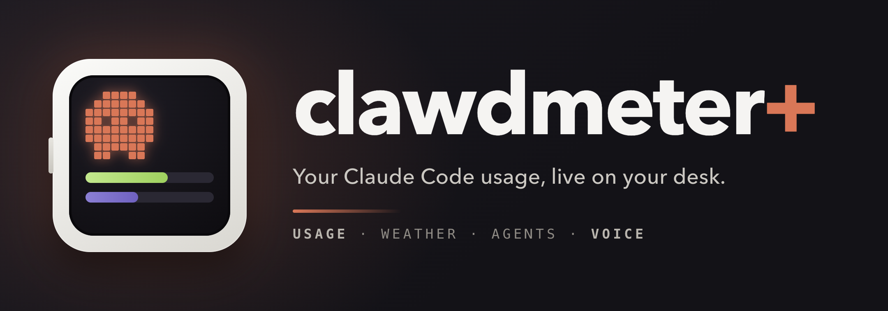
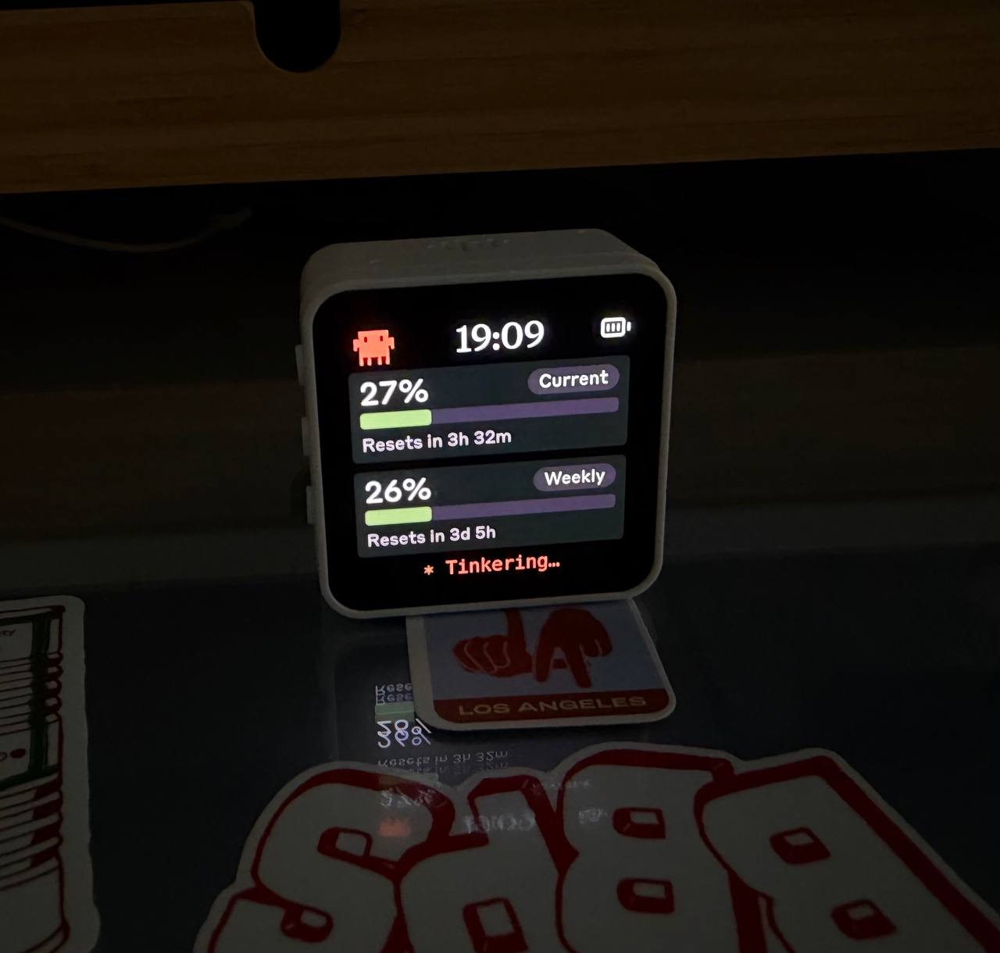
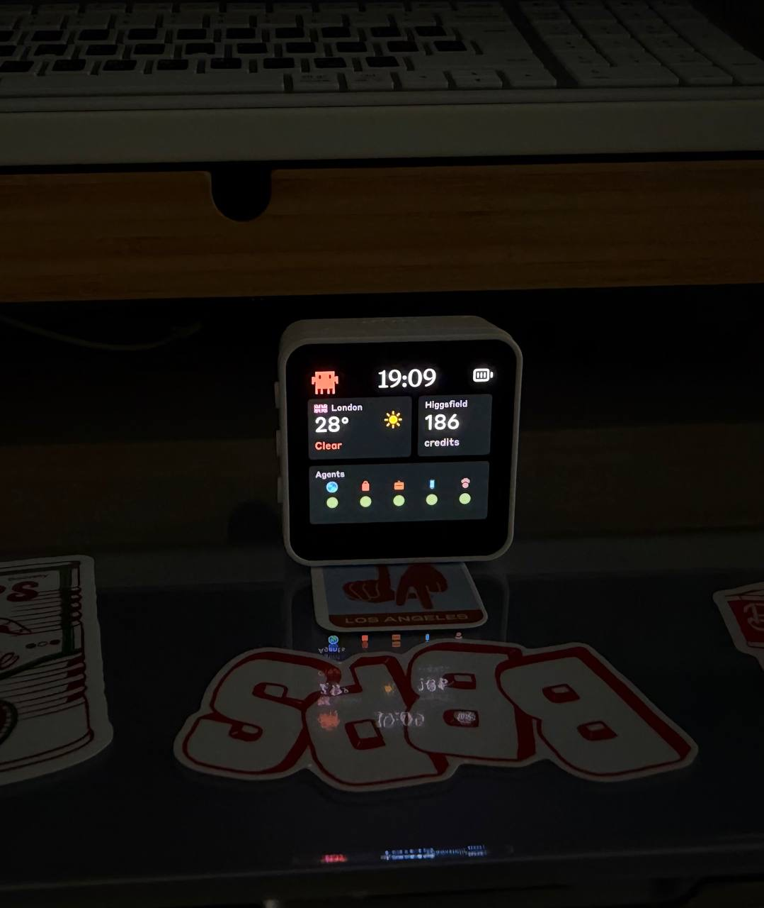
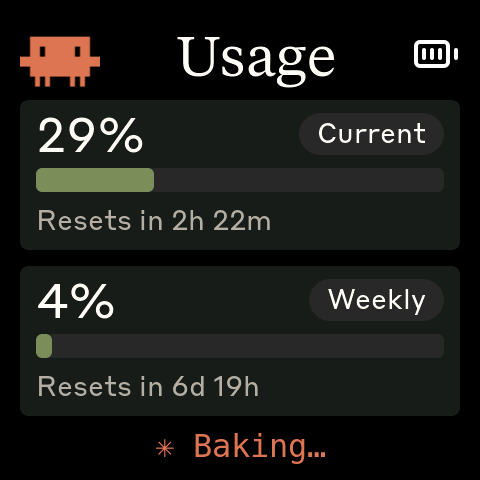
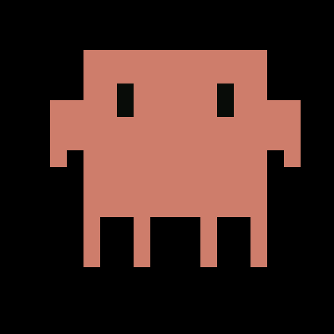
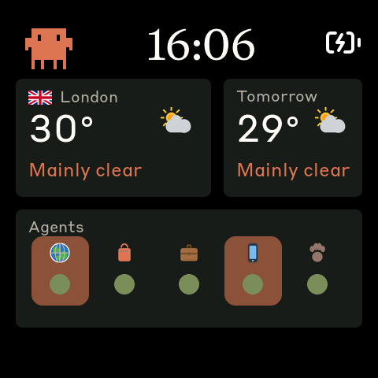
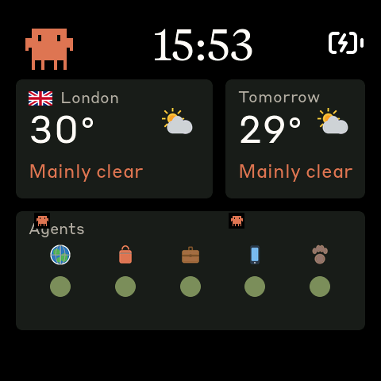
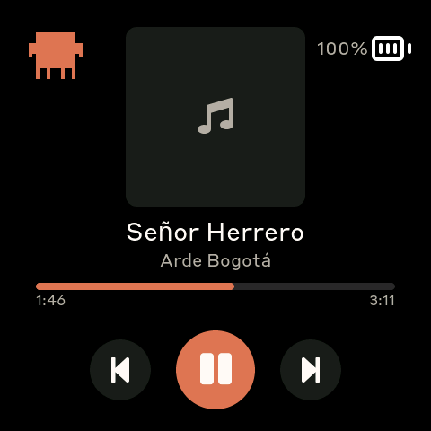

<p align="center">
  
</p>

# Clawdmeter Plus (versión de Propia)

> **Este proyecto es un fork del original.** El proyecto base es
> [Clawdmeter Plus de sorryhumans](https://github.com/sorryhumans/clawdmeter-plus), que a su vez
> parte de [Clawdmeter de Hermann Bjorgvin](https://github.com/HermannBjorgvin/Clawdmeter).
> El firmware, las pantallas y el daemon base son obra de sus autores.
> Yo (Domingo) le he añadido **mejoras y personalizaciones propias, con mi configuración**, y una
> **instalación mucho más sencilla en Windows** (basta un `git clone` y un par de comandos).
> El resto del documento es el README original, traducido al español.

¿Que es esto?
Una pequeña pantalla AMOLED de escritorio que muestra tu uso de **Claude Code** en directo, la
hora, el tiempo, el estado de varios servicios y una mascota animada en pixel art.
Funciona con una [Waveshare ESP32-S3-Touch-AMOLED-2.16](https://www.waveshare.com/esp32-s3-touch-amoled-2.16.htm?&aff_id=149786)
y se comunica por Bluetooth LE con un pequeño daemon que corre en tu PC.

> Es un proyecto personal, independiente y **no oficial**. No está afiliado, respaldado ni
> patrocinado por Anthropic. Consulta [Créditos y licencia](#créditos-y-licencia).

<p align="center">
  
  
</p>

> La construcción terminada sobre la mesa. Las capturas nítidas más abajo se sacan directamente
> del framebuffer de la pantalla.

---

## Qué he cambiado respecto al original

- **Tiempo de Murcia** en lugar de Londres (las coordenadas están en `WX_URL` dentro de
  `daemon/claude_usage_daemon_windows.py`).
- **Panel «Servicios»** en la segunda pantalla, cada uno con su logo: Claude, GitHub, Azure DevOps,
  Shopify y un MiniPC (por ping). Se comprueban cada 3 minutos. Verde = funciona, rojo = caído,
  gris = sin datos. Sin parpadeos, solo colores.
- **Porcentaje de batería** junto al icono de la batería.
- **Hora** visible también en la segunda pantalla.
- **Pantalla Música**: una tercera página con la canción que suena en el PC (Spotify u otra app),
  carátula, progreso y botones táctiles para pasar canciones. Ver [Pantalla Música](#3-pantalla-música-añadido-de-este-fork).
- **Táctil que sigue la rotación** de la pantalla (antes solo acertaba en una orientación).
- **Instalación simplificada en Windows**: scripts en `scripts/` sin rutas fijas (usan
  `%USERPROFILE%` y `%LOCALAPPDATA%`), así que funcionan igual en cualquier PC y con cualquier usuario.
- **Carpeta `custom/`** con los parches y los iconos PNG que uso, y cómo cambiarlos.

---

## Instalación paso a paso en Windows

Todo se instala dentro de tu carpeta de usuario, así que funciona igual en cualquier ordenador.
Hay una guía más detallada (solución de problemas, cambiar la placa de PC…) en
[INSTALACION.md](INSTALACION.md).

**Requisitos**

- Windows 10/11 con Bluetooth
- [Python 3.10 o superior](https://www.python.org/downloads/) (marca *Add python.exe to PATH*)
- [Git](https://git-scm.com/download/win)
- Claude Code instalado y con la sesión iniciada (ejecuta `claude` una vez)
- La placa Waveshare con el firmware ya flasheado (ver [Flashear el firmware](#flashear-el-firmware))

**1. Clonar el repositorio** (en PowerShell):

```powershell
cd $env:USERPROFILE
git clone https://github.com/dominmd-ucam/Clawdmeter.git
cd Clawdmeter
```

**2. Instalar el daemon:**

```powershell
powershell -ExecutionPolicy Bypass -File .\scripts\install.ps1
```

Crea el entorno Python (`.venv`), el fichero de configuración y el arranque automático al iniciar sesión.

**3. Emparejar la placa:**

1. Enciende la placa (verás «Waiting»).
2. Ajustes de Windows → Bluetooth → Añadir dispositivo → **Clawdmeter**.
3. La pantalla pasará a «Listening» y después a «Connected» cuando lleguen los datos.

**4. Uso diario:**

```powershell
cd $env:USERPROFILE\Clawdmeter
.\scripts\status.ps1    # estado, emparejado, credenciales y log
.\scripts\start.ps1     # arrancar / reiniciar
.\scripts\stop.ps1      # parar
```

**5. Actualizar:**

```powershell
git pull
.\scripts\start.ps1
```

**Scripts disponibles**

| Script | Para qué sirve |
| --- | --- |
| `scripts\install.ps1` | Instala todo (entorno Python, configuración, arranque automático) |
| `scripts\start.ps1` / `stop.ps1` | Arrancar o reiniciar / parar el daemon |
| `scripts\status.ps1` | Ver estado, emparejado, credenciales y log |
| `scripts\flash.ps1` | Flashear el firmware por USB (autodetecta el puerto) |
| `scripts\uninstall.ps1` | Quitar el arranque automático y parar el daemon |
| `scripts\publish.ps1` | Subir cambios a este repositorio |

Configuración en `%LOCALAPPDATA%\Clawdmeter\config`: `clock` (12/24), `chime` (on/off),
`minipc` (IP para el ping) y `config_dirs` (varias cuentas de Claude). El log está en
`%LOCALAPPDATA%\Clawdmeter\daemon.log`.

---

## Qué muestra

La pantalla tiene tres páginas. Pulsa el botón central **PWR** para cambiar entre ellas.

### 1. Pantalla de uso (lo principal)

Tus límites de Claude Code en directo, tomados de la API de uso de Anthropic:

- **Límite de sesión** (la ventana móvil de 5 horas) y **límite semanal**, como anillos/barras
- Ritmo de consumo actual, para ver a qué velocidad gastas
- Una mascota **Clawd** animada en pixel art
- Reloj opcional en lugar del título «Usage»

<p align="center">
  
  
</p>

### 2. Pantalla de estado (añadidos de este fork)

Un panel de tipo «bento»:

- **Reloj** (12 h/24 h)
- **Tiempo** — temperatura actual + icono de la condición (open-meteo, sin clave de API). En mi
  versión, Murcia.
- **Mañana** — máxima prevista de mañana + icono
- **Puntos de agentes** — en el original, cinco puntos de salud para agentes de Claude en segundo
  plano que corren en una sesión local de `tmux`, cada uno con un icono de identidad; el que está
  *trabajando* se resalta con un **resplandor naranja pulsante**.
  **En mi versión este panel es «Servicios»**: Claude, GitHub, Azure DevOps, Shopify y MiniPC.
- La mascota animada, también en esta página

<p align="center">
  
  
</p>

En el original, el panel de agentes está pensado para una configuración multiagente concreta
(busca ventanas de `tmux` con nombre). Si no ejecutas agentes así, los puntos simplemente quedan
inactivos y el resto funciona igual. Consulta [Personalización](#personalización).

### 3. Pantalla Música (añadido de este fork)

Lo que está sonando en el PC, con controles:

- **Carátula** del álbum, **título** y **artista** (con tildes, ñ y comillas tipográficas)
- **Barra de progreso** con tiempo transcurrido y duración
- Botones táctiles **⏮ ⏯ ⏭** que actúan sobre Spotify en el PC
- «Nada sonando» cuando no hay nada reproduciéndose

<p align="center">
  
</p>

**No necesita la API de Spotify ni ninguna clave.** El daemon lee la sesión multimedia de Windows
(SMTC, la misma que muestran las teclas multimedia), así que también funciona con otras apps que
la publiquen (navegador, VLC…). Funcionamiento:

- El daemon envía la canción cada 2 s si cambia, y la carátula (JPEG de 200×200, ~8 KB) solo
  cuando cambia el álbum. Tarda menos de medio segundo.
- Al pulsar un botón, la placa avisa al daemon y este manda la orden a Spotify. No usa teclas
  multimedia, así que actúa sobre Spotify aunque haya otra app con sonido.
- Solo Windows por ahora (el daemon de macOS no envía música).

**Al actualizar desde una versión sin esta pantalla:**

1. `git pull` y vuelve a ejecutar `.\scripts\install.ps1` (instala las dependencias nuevas `winrt-*`).
2. Flashea el firmware (ver [Flashear el firmware](#flashear-el-firmware)).
3. **Quita «Clawdmeter» de Bluetooth en Windows y empareja de nuevo, una vez.** El firmware añade
   servicios Bluetooth nuevos y Windows guarda en caché la lista antigua; sin reemparejar, el log
   del daemon dice `Board firmware has no music screen; media disabled`.

### Controles

| Acción | Qué hace |
| --- | --- |
| Pulsar **PWR** (botón central) | Cambia de página: Uso → Estado → Música |
| Tocar ⏮ ⏯ ⏭ (en Música) | Canción anterior / play-pausa / siguiente en Spotify |
| Tocar la pantalla (fuera de los botones) | Muestra u oculta la pantalla de la mascota |
| Mantener **PWR** ~3 s | Modo de emparejamiento (borra el vínculo Bluetooth) |
| Botones laterales | Teclas BLE HID que puedes usar dentro de Claude Code (p. ej. pulsar para hablar) |

---

## Hardware

| Pieza | Notas |
| --- | --- |
| **[Waveshare ESP32-S3-Touch-AMOLED-2.16](https://www.waveshare.com/esp32-s3-touch-amoled-2.16.htm?&aff_id=149786)** | La placa. AMOLED de 480×480, táctil capacitiva, IMU, altavoz integrado, USB-C. Es el objetivo principal de compilación (`waveshare_amoled_216`). |
| **Batería LiPo** (opcional) | Una LiPo de una celda a 3,7 V con el conector JST de la placa la hace inalámbrica. El AXP2101 integrado la carga por USB por defecto. Cuidado con la polaridad del conector. |
| **Altavoz integrado** | La placa de 2,16" lleva un códec ES8311 y altavoz, usados para el aviso de reinicio de sesión y la [voz diaria](#la-voz-diaria). |
| **Cable USB-C de datos** | Necesario para flashear. Usa un cable de **datos**, no uno solo de carga. |

El firmware también admite otras placas de la misma familia; consulta
[Placas compatibles](#placas-compatibles).

> Con batería, el dispositivo se apaga la pantalla tras unos minutos de inactividad para ahorrar
> energía y despierta al pulsar PWR; con USB está siempre encendido. Una pantalla oscura tras una
> noche con batería es normal: pulsa PWR.

---

## Montaje

1. Si añades batería, conecta la LiPo al conector JST de la placa (revisa la polaridad) y colócala en la carcasa.
2. Conecta la placa al ordenador con un cable USB-C de **datos**.
3. Eso es todo el montaje: flashea el firmware y después ejecuta el daemon.

*(Aquí se añadirán fotos de la carcasa y el cableado.)*

---

## Flashear el firmware

El firmware es un proyecto [PlatformIO](https://platformio.org/) (C++ / LVGL 9).

### En Windows (mi forma)

Con la placa conectada por USB:

```powershell
cd $env:USERPROFILE\Clawdmeter
.\scripts\flash.ps1               # detecta el puerto automáticamente
.\scripts\flash.ps1 -Port COM3    # o indicando el puerto
```

Si PlatformIO no está instalado, el script lo instala. Equivale a:
`python -m platformio run -d firmware -e waveshare_amoled_216 -t upload --upload-port COM3`
(importante indicar siempre `-e`, o compilará todas las placas).

### En macOS (original)

**Requisitos**

```bash
brew install platformio        # proporciona el comando `pio`
```

**Flashear (script de conveniencia, detecta el puerto USB):**

```bash
./flash-mac.sh waveshare_amoled_216
# o indicando el puerto explícitamente:
./flash-mac.sh waveshare_amoled_216 /dev/cu.usbmodem1101
```

**Flashear (PlatformIO directo):**

```bash
pio run -e waveshare_amoled_216 -t upload
```

Si no aparece ningún dispositivo `/dev/cu.usbmodem*`, el cable es solo de carga o la placa necesita
el modo de descarga: mantén pulsado **BOOT** mientras la conectas y vuelve a flashear.

Para ver la salida por serie:

```bash
pio device monitor -e waveshare_amoled_216 -b 115200
```

---

## Ejecutar el daemon en macOS

> En Windows usa la [instalación paso a paso](#instalación-paso-a-paso-en-windows) de arriba.

La placa es solo una pantalla; un pequeño daemon en Python (`bleak` + `httpx`) es el cerebro. Lee
tu uso de Claude, consulta el tiempo, comprueba la salud de los agentes y envía un JSON compacto a
la placa por BLE cada ~60 s.

**Nunca guarda un token en este repositorio.** En macOS lee tu token OAuth de Claude Code desde el
**Llavero** de inicio de sesión (servicio `Claude Code-credentials`) en tiempo de ejecución: la misma
credencial que usa el propio Claude Code. Solo necesitas haber iniciado sesión en Claude Code.

**Instalar:**

```bash
./install-mac.sh
```

Esto hará lo siguiente:

1. Crea un entorno virtual de Python en `daemon/.venv` (instala `bleak` + `httpx`).
2. Genera y carga un agente **launchd** (`com.user.claude-usage-daemon`) para que el daemon arranque
   al iniciar sesión y se reinicie si falla.
3. Opcionalmente instala `blueutil` (recupera automáticamente el vínculo BLE tras reflashear).
4. Hace un par de preguntas de configuración (reloj, aviso sonoro, varios planes).

**Emparejar el dispositivo** (una vez, tras flashear):

1. Enciende la placa.
2. Ajustes del Sistema → **Bluetooth** → **Conectar** junto a **«Clawdmeter»**.
3. macOS pedirá permitir Bluetooth al daemon: pulsa **Permitir**. (Puede aparecer una ventana de
   «Asistente de configuración de teclado» porque la placa también expone teclas BLE HID: ciérrala y
   no pulses ninguna tecla.)

El daemon descubre el dispositivo emparejado en ~30 s y empieza a enviar datos.

**Registros y control:**

```bash
tail -F ~/Library/Logs/claude-usage-daemon.out.log     # "Sending: {…ok:true}" = todo bien
launchctl unload -w ~/Library/LaunchAgents/com.user.claude-usage-daemon.plist  # parar
launchctl load   -w ~/Library/LaunchAgents/com.user.claude-usage-daemon.plist  # arrancar
```

> **Linux / Windows:** el proyecto original también incluye una unidad `systemd`
> (`daemon/claude-usage-daemon.sh`, `install.sh`) y un daemon con icono de bandeja para Windows
> (`daemon/*_windows.*`, `install-windows.ps1`, `daemon/README-windows.md`). Las funciones extra del
> fork original se desarrollaron y probaron en macOS; mis personalizaciones, en Windows.

### Mantener el token «caliente» (opcional)

El token OAuth del Llavero tiene una vida corta y solo se renueva cuando *algún* proceso de Claude
Code hace una llamada. Durante largas pausas puede caducar y el dispositivo muestra datos antiguos
hasta la siguiente actividad. `daemon/token_keepwarm.sh` es un pequeño trabajo de launchd que gasta
una llamada `claude -p` desechable solo cuando al token le quedan unos 6 min, forzando la renovación.
Es opcional, pero útil para una pantalla siempre encendida.

---

## Configuración

Las opciones del daemon están en un fichero de configuración simple que se vuelve a leer en cada
consulta (no hace falta reiniciar):

- macOS/Linux: `~/.config/claude-usage-monitor/config`
- Windows: `%LOCALAPPDATA%\Clawdmeter\config`

Copia [`daemon/config.example`](daemon/config.example) para empezar. Claves:

- `clock` — `off` / `auto` / `12` / `24` (muestra un reloj en la pantalla de uso)
- `chime` — `on` / `off` (reproduce un sonido por el altavoz cuando se reinicia el límite de sesión de 5 horas)
- `config_dirs` — consulta varios planes `~/.claude*` y muestra el que esté activo
- `minipc` — (solo mi versión) IP del MiniPC a la que hacer ping en el panel de servicios

---

## La voz diaria

La placa te habla por su altavoz integrado dos veces al día:

- **08:00** — un breve saludo motivador por la mañana
- **20:00** — un mensaje de desconexión/descanso por la tarde

Cada uno suena una vez al día, programado con el reloj del dispositivo. El audio va incrustado en el
firmware como PCM a 12 kHz (`firmware/src/voice_morning_pcm.h` y `voice_evening_pcm.h`) y se
reproduce mediante el códec ES8311.

**Probar los clips por serie** (sin esperar a la hora):

```
voice1   # reproduce el clip de la mañana
voice2   # reproduce el clip de la tarde
```

**Cambiar las horas:** edita el horario en `firmware/src/main.cpp` (busca `voice_schedule_tick`): las
dos líneas comparan el minuto del día con `8 * 60` y `20 * 60`. Cámbialas y reflashea.

**Cambiar los mensajes / el idioma:** lo más fácil es usar el ayudante incluido. Escribe tu texto, en
cualquier idioma, y regenera la cabecera por ti:

```bash
tools/gen_voice.sh morning en "Good morning! Have a productive day."
tools/gen_voice.sh evening uk "Добрий вечір. Час відпочивати."
# después reflashea:
./flash-mac.sh waveshare_amoled_216
```

Usa el TTS gratuito de Google Translate (sin clave de API) y escribe una cabecera PCM de 12 kHz /
16 bits / mono con los nombres de símbolo correctos. Necesita `ffmpeg` (`brew install ffmpeg`). Mantén
los clips cortos: viven en la partición de la aplicación junto al firmware. ¿Prefieres tu propio
audio? Sirve cualquier PCM de 12 kHz/16 bits/mono volcado como array de bytes en C con la misma forma
(imita `bell_pcm.h`).

> Los clips incluidos están en **inglés** (saludos genéricos para que cualquiera pueda usar la
> compilación tal cual). Cámbialos por tu idioma o tus palabras con el comando de arriba.

---

## Personalización

- **Ciudad del tiempo** — el daemon original consulta Londres. Edita la latitud/longitud de open-meteo
  (la petición `WX_URL`) en `daemon/claude_usage_daemon.py` (en Windows,
  `daemon/claude_usage_daemon_windows.py`) para tu ciudad. En mi versión está puesta Murcia.
- **Puntos de agentes** — el daemon original los enciende a partir de agentes en segundo plano con
  nombre dentro de una sesión local de `tmux`. Si no usas esa configuración, los puntos quedan
  inactivos y son inofensivos; o adapta `add_agent_health_fields` / `add_agent_busy_fields` del daemon
  a tu propia señal.
- **Iconos de servicios** — sustituye los PNG de `custom/icons/` y ejecuta
  `python custom\patch_logos.py . custom\icons`; después reflashea. Detalles en
  [`custom/README.md`](custom/README.md).
- **Añadir una placa** — el firmware se estructura alrededor de una pequeña HAL, de modo que los
  paneles nuevos se añaden en `firmware/src/boards/<nombre>/`. Consulta
  [`docs/porting/adding-a-board.md`](docs/porting/adding-a-board.md).

---

## Solución de problemas

| Síntoma | Causa probable / solución |
| --- | --- |
| Pantalla «Waiting» | No hay conexión Bluetooth. Ejecuta `.\scripts\status.ps1`; si no aparece emparejada, elimina «Clawdmeter» en Windows, mantén PWR ~3 s en la placa y empareja de nuevo. |
| Pantalla «Listening» sin datos | Hay conexión pero no llegan datos. Mira el log con `.\scripts\status.ps1`. |
| `HTTP 401` en el log | Token caducado. Abre Claude Code una vez para renovar la sesión. |
| «Connection lost» | Ejecuta `.\scripts\start.ps1`. |
| Pantalla oscura / sin actualizar | Normalmente es la **suspensión por batería**, no un fallo. Pulsa PWR para despertar o déjala en USB (con USB nunca se apaga). En macOS: `blueutil --connected \| grep -i clawd`; si no aparece, está dormida. |
| Sin datos de Claude en pantalla | Problema de token. Busca `HTTP 401` en el log del daemon. Asegúrate de haber iniciado sesión en Claude Code; considera el [ayudante de token caliente](#mantener-el-token-caliente-opcional). |
| El daemon nunca conecta bajo launchd (macOS) | Necesita su **propio** permiso de Bluetooth. Concede a Python el permiso en Ajustes del Sistema → Privacidad y seguridad → Bluetooth y ejecuta `launchctl kickstart -k gui/$(id -u)/com.user.claude-usage-daemon`. |
| `install-mac.sh` se cuelga en una shell no interactiva | El paso [5/6] hace un escaneo previo en primer plano. Ejecútalo como `echo n \| ./install-mac.sh` para saltarlo y aun así cargar el agente launchd. |
| Pantalla Música en «Nada sonando» con Spotify abierto | Busca `Board firmware has no music screen` en el log: reempareja la placa una vez (ver [Pantalla Música](#3-pantalla-música-añadido-de-este-fork)). Si no aparece, comprueba que Spotify está reproduciendo, no solo abierto. |
| Sale la nota musical en lugar de la carátula | Windows no ha publicado la carátula de esa canción (pasa a veces con Spotify). Suele aparecer en la siguiente. |
| Los botones de Música hacen cosas raras en una orientación | Reflashea el firmware actual: el táctil sigue la rotación de la pantalla desde la versión con la pantalla Música. |
| BLE no reconecta tras reflashear | Vínculo obsoleto. Instala `blueutil` (el instalador lo ofrece) para recuperación automática, o «Olvidar este dispositivo» en Bluetooth y empareja de nuevo. |

---

## Placas compatibles

El firmware admite cuatro placas de la misma familia (cada una es un entorno de PlatformIO). Esta
compilación apunta a la primera:

- `waveshare_amoled_216` — **Waveshare ESP32-S3-Touch-AMOLED-2.16** (480×480, objetivo principal)
- `waveshare_amoled_18` — Waveshare ESP32-S3-Touch-AMOLED-1.8 (368×448)
- `waveshare_amoled_216_c6` — variante ESP32-C6 (sin PSRAM)
- `waveshare_amoled_18_c6` — variante ESP32-C6 (sin PSRAM)

Las funciones de audio (aviso, voz diaria) requieren una placa con códec/altavoz integrado (las S3 de
2,16" y 1,8").

La pantalla Música funciona en todas, pero la **carátula necesita PSRAM** (placas S3): en las C6 se
muestra la nota musical en su lugar. Solo está probada en la 2,16" S3.

---

## Estructura del repositorio

```
firmware/          proyecto PlatformIO (C++ / LVGL 9)
  platformio.ini   entornos por placa + configuración de compilación
  src/             UI compartida + HAL por placa (src/boards/, src/hal/)
daemon/            daemon anfitrión macOS/Linux/Windows (Python) + scripts de instalación
  claude_usage_daemon.py          el daemon de macOS (bleak + httpx, envío por BLE)
  claude_usage_daemon_windows.py  el daemon de Windows (con mis personalizaciones)
  media_windows.py                (mío) lectura de la música de Windows para la pantalla Música
  config.example                  plantilla de configuración del daemon
  token_keepwarm.sh               mantenimiento opcional del token OAuth (launchd)
scripts/           (mío) instalación y arranque en Windows, sin rutas fijas
custom/            (mío) parches, iconos PNG de servicios y su documentación
tools/             generadores de iconos/fuentes/sprites
docs/porting/      cómo añadir una placa nueva
assets/            fuentes, iconos, medios de demostración (ver aviso en LICENSE)
images/            capturas usadas en este README
flash-mac.sh       compila y sube el firmware (macOS)
install-mac.sh     configura el daemon (venv + launchd)
INSTALACION.md     (mío) guía detallada de instalación en Windows
```

---

## Créditos y licencia

- Construido sobre el proyecto de código abierto **[Clawdmeter](https://github.com/HermannBjorgvin/Clawdmeter)**
  de **Hermann Bjorgvin**: la pantalla original de uso de Claude con ESP32, la arquitectura del
  firmware y la integración de la mascota Clawd. Muchas gracias. ⭐
- Fork base: **[Clawdmeter Plus](https://github.com/sorryhumans/clawdmeter-plus)** (sorryhumans).
- Tiempo de [open-meteo](https://open-meteo.com/) (gratis, sin clave).
- Hecho con [PlatformIO](https://platformio.org/), [LVGL](https://lvgl.io/),
  [bleak](https://github.com/hbldh/bleak) y [httpx](https://www.python-httpx.org/).

**Licencia:** el código fuente se ofrece bajo la **licencia MIT**. Sin embargo, este repositorio (como
el original) incluye **fuentes propietarias** (Styrene B, Tiempos) y la **ilustración protegida de la
mascota Clawd / Claude**, que son propiedad de sus titulares y **no** están cubiertas por MIT.
«Claude», «Claude Code» y «Anthropic» son marcas de Anthropic PBC. **Lee [`LICENSE`](LICENSE) completo
antes de redistribuir**: si publicas una compilación, eres responsable de los derechos sobre esos
recursos (o de reemplazarlos). Las notas originales del autor del proyecto base se conservan en
[`README.upstream.md`](README.upstream.md).

---

## Autoría

El proyecto base fue creado por **Oleh** — [@iam.oleh en Instagram](https://www.instagram.com/iam.oleh).
Las personalizaciones, los scripts de instalación para Windows y esta traducción son de **Domingo**.
